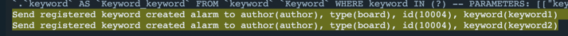
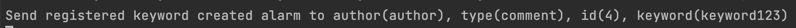

# 댓글 기능이 있는 익명 게시판 및 키워드 알림 기능 구현

---

## Prerequisite

* docker desktop (docker-compose)

## Development environment
- 언어 : Typescript
- 프레임워크 : Nest.js
- DB : Mysql (8.0.29)
- ORM : TypeOrm (0.3.7)
- OS : Mac OS
- IDE : IntelliJ
- Container orchestration : Docker-Compose

## Description

> Nest.js 와 TypeOrm 을 사용하여 요구사항을 구현하였습니다.<br>
> DB 스키마 생성 스크립트 및 시드 스크립트는 TypeOrm 의 migration 기능을 사용하였습니다. 앱 구동 시 migration 이 적용됩니다.<br>
> Docker-Compose 를 사용해 앱과 DB 를 간편하게 설치 및 구동할 수 있게 하였습니다.<br>
> 요구사항 중 키워드 알림 기능은 Nest.js(Node.Js) 의 event-emitter 패키지를 사용하여 구현하였습니다.<br>
> 구현된 모든 API 의 명세(OpenAPI Specification) 및 테스트는 Docker-Compose 로 앱&DB 구동 후 https://localhost:3000/api-docs 에서 확인 가능합니다.<br>
> 앱 구동 시 DB migration 적용으로 인해 시간이 조금 걸릴 수 있습니다.<br>
> 게시글 작성시 입력한 비밀번호는 데이터베이스에 단방향 암호화(hash, salt) 되어 저장됩니다.

## Running the app

```bash
$ docker-compose up -d
```

## Implementation list
- [x] 게시글 목록 API
- [x] 게시글 작성 API
- [x] 게시글 수정 API
- [x] 게시글 삭제 API
- [x] 댓글 목록 API
- [x] 댓글 작성 API
- [x] 게시물 또는 댓글 등록시 알림 기능 구현
- [x] DB 스키마 생성 스크립트

## API 명세

### 1. 게시글 목록 API

`app>src>board>board.controller.ts` : API 정의

게시글을 조회합니다. 검색타입, 검색어 입력 시 검색된 목록만 조회됩니다.

#### 요청 메시지 URL

```
http://localhost:3000/board?page=1&limit=20&order=DESC&searchType=TITLE&search=test
Method GET
```

|Method|                                          Path                                          |
|:----:|:--------------------------------------------------------------------------------------:|
|GET| /board/page={page}&limit={limit}&order={order}&searchType={searchType}&search={search} |

#### 요청 메시지 명세

|분류|     항목     |       설명        |
|:----:|:----------:|:---------------:|
|Request param|    page    |     페이지 인덱스     |
|Request param|   limit    |    조회 데이터 수     |
|Request param|   order    |      정렬 순서      |
|Request param| searchType | 검색기준(제목 또는 작성자) |
|Request param|   search   |       검색어       |

#### 응답 메시지 명세

| 항목                           | 설명             |
|:-----------------------------|:---------------|
| is_success                   | api 요청 성공 여부   |
| data                         | 데이터 리스트        |
| --board                      | 게시글            |
| ----id                       | 게시글 번호         |
| ----createdAt                | 게시글 생성일시       |
| ----title                    | 게시글 제목         |
| ----content                  | 게시글 내용         |
| ----author                   | 게시글 작성자        |
| ----updatedAt                | 게시글 수정일시       |
| --pageMeta                   | 페이징 메타정        |
| ----hasPreviousPage | 이전 페이지 존재여부    |
| ----hasNextPage      | 다음 페이지 존재여부    |
| ----currentPage              | 현재 페이지         |
| ----totalPageCount           | 전체 페이지 갯수      |
| ----totalCount               | 전체 게시글 갯수      |
| ----limit                    | 페이지당 게시글 갯수 |

#### 응답 메시지 예시

```json
{
  "isSuccess": true,
  "data": [
    {
      "id": 0,
      "createdAt": "2022-08-31T03:03:01.470Z",
      "title": "string",
      "content": "string",
      "author": "string",
      "updatedAt": "2022-08-31T03:03:01.470Z"
    }
    ...
  ],
  "pageMeta": {
    "hasPreviousPage": false,
    "hasNextPage": true,
    "currentPage": 1,
    "totalPageCount": 10,
    "totalCount": 99,
    "limit": 10
  }
}
```

### 2. 게시글 작성 API

`app>src>board>board.controller.ts` : API 정의

> 게시글을 작성합니다.<br>
> 게시글 작성 시 입력된 비밀번호는 단방향 암호화(hash, salt) 되어 저장됩니다.<br>
> 게시글 작성 완료 후 마지막 로직에서 생성 event 를 emit 합니다.
> 생성된 이벤트는 등록된 핸들러에 의해 비동기로 처리되며,
> keyword 테이블에 등록된 키워드 중 매칭되는 키워드가 게시글 내용에 포함되어있는지 확인 후 alarm 함수를 호출합니다

### alarm 함수 호출 시 콘솔 출력


#### 요청 메시지 URL

```
http://localhost:3000/board
Method POST
```

| Method |                                          Path                                          |
|:------:|:--------------------------------------------------------------------------------------:|
|  POST  | /board |

#### 요청 메시지 명세

|      분류       |    항목    |    설명    |
|:-------------:|:--------:|:--------:|
| Request body  |  title   |  게시글 제목  |
| Request body | content  |  게시글 내용  |
| Request body |  author  |   작성자    |
| Request body | password | 게시글 비밀번호 |

#### 요청 메시지 예시

```json
{
  "title": "string",
  "content": "string",
  "author": "string",
  "password": "string"
}
```

#### 응답 메시지 명세

| 항목                           | 설명           |
|:-----------------------------|:-------------|
| is_success                   | api 요청 성공 여부 |
| data                         | 데이터          |
| --id                       | 게시글 번호       |
| --createdAt                | 게시글 생성일시     |
| --title                    | 게시글 제목       |
| --content                  | 게시글 내용       |
| --author                   | 게시글 작성자      |
| --updatedAt                | 게시글 수정일시     |

#### 응답 메시지 예시

```json
{
  "isSuccess": true,
  "data": {
    "id": 1000,
    "createdAt": "2022-08-31T03:28:01.515Z",
    "title": "string",
    "content": "string",
    "author": "string",
    "updatedAt": "2022-08-31T03:28:01.515Z"
  }
}
```

### 3. 게시글 수정 API

`app>src>board>board.controller.ts` : API 정의

게시글을 수정합니다. 게시글 작성 시 입력한 비밀번호와 동일한 비밀번호를 입력해야 합니다.

#### 요청 메시지 URL

```
http://localhost:3000/board
Method PUT
```

| Method |                                          Path                                          |
|:------:|:--------------------------------------------------------------------------------------:|
|  PUT   | /board |

#### 요청 메시지 명세

|      분류       |    항목    |    설명    |
|:-------------:|:--------:|:--------:|
| Request body  |    id    |  게시글 id  |
| Request body | content  |  게시글 내용  |
| Request body | password | 게시글 비밀번호 |

#### 요청 메시지 예시

```json
{
  "id": 1,
  "content": "string",
  "password": "string"
}
```

#### 응답 메시지 명세

| 항목                           | 설명           |
|:-----------------------------|:-------------|
| is_success                   | api 요청 성공 여부 |
| data                         | 데이터          |
| --id                       | 게시글 번호       |
| --title                    | 게시글 제목       |
| --content                  | 게시글 내용       |
| --author                   | 게시글 작성자      |

#### 응답 메시지 예시

```json
{
  "isSuccess": true,
  "data": {
    "id": 1,
    "title": "title1",
    "content": "string",
    "author": "author",
    "createdAt": "2022-08-31T03:28:01.515Z",
    "updatedAt": "2022-08-31T03:28:01.515Z"
  }
}
```

### 4. 게시글 삭제 API

`app>src>board>board.controller.ts` : API 정의

게시글을 수정합니다. 게시글 작성 시 입력한 비밀번호와 동일한 비밀번호를 입력해야 합니다.

#### 요청 메시지 URL

```
http://localhost:3000/board
Method DELETE
```

| Method |                                          Path                                          |
|:------:|:--------------------------------------------------------------------------------------:|
| DELETE | /board |

#### 요청 메시지 명세

|      분류       |    항목    |    설명    |
|:-------------:|:--------:|:--------:|
| Request body  |    id    |  게시글 id  |
| Request body | password | 게시글 비밀번호 |

#### 요청 메시지 예시

```json
{
  "id": 1,
  "password": "string"
}
```

#### 응답 메시지 명세

| 항목                           | 설명           |
|:-----------------------------|:-------------|
| is_success                   | api 요청 성공 여부 |

#### 응답 메시지 예시

```json
{
  "isSuccess": true
}
```

### 5. 댓글 목록 API

`app>src>comment>comment.controller.ts` : API 정의

댓글을 조회합니다. 조회 시 boardId(게시글 번호) param 을 입력하면 해당 게시글의 댓글만 조회할 수 있습니다.

#### 요청 메시지 URL

```
http://localhost:3000/comment?page=1&limit=20&order=DESC
Method GET
```

|Method|                       Path                       |
|:----:|:------------------------------------------------:|
|GET| /comment/page={page}&limit={limit}&order={order} |

#### 요청 메시지 명세

|분류|   항목    |    설명   |
|:----:|:-------:|:-------:|
|Request param|  page   | 페이지 인덱스 |
|Request param|  limit  | 조회 데이터 수 |
|Request param|  order  |  정렬 순서  |
|Request param| boardId | 게시글 번호  |

#### 응답 메시지 명세

| 항목                  | 설명                                     |
|:--------------------|:---------------------------------------|
| is_success          | api 요청 성공 여부                           |
| data                | 데이터 리스트                                |
| --comment           | 댓글                                     |
| ----id              | 댓글 번호                                  |
| ----createdAt       | 댓글 생성일시                                |
| ----content         | 댓글 내용                                  |
| ----author          | 댓글 작성자                                 |
| ----parent          | 부모 댓글(댓글일 경우 0, 대댓글일 경우 댓글의 id 를 가집니다) |
| --pageMeta          | 페이징 메타정                                |
| ----hasPreviousPage | 이전 페이지 존재여부                            |
| ----hasNextPage     | 다음 페이지 존재여부                            |
| ----currentPage     | 현재 페이지                                 |
| ----totalPageCount  | 전체 페이지 갯수                              |
| ----totalCount      | 전체 게시글 갯수                              |
| ----limit           | 페이지당 게시글 갯수                            |

#### 응답 메시지 예시

```json
{
  "isSuccess": true,
  "data": [
    {
      "id": 1,
      "createdAt": "2022-08-30T19:15:21.711Z",
      "content": "string",
      "author": "string",
      "parent": 0
    }
  ],
  "pageMeta": {
    "totalPageCount": 1,
    "hasPreviousPage": false,
    "hasNextPage": false,
    "currentPage": 1,
    "totalCount": 1,
    "limit": 10
  }
}
```

### 6. 댓글 작성 API

`app>src>comment>comment.controller.ts` : API 정의

> 댓글을 작성합니다.<br>
> 게시글 작성 시 입력된 비밀번호는 단방향 암호화(hash, salt) 되어 저장됩니다.<br>
> 댓글 작성 완료 후 마지막 로직에서 생성 event 를 emit 합니다.
> 생성된 이벤트는 등록된 핸들러에 의해 비동기로 처리되며,
> keyword 테이블에 등록된 키워드 중 매칭되는 키워드가 댓글의 내용에 포함되어있는지 확인 후 alarm 함수를 호출합니다

### alarm 함수 호출 시 콘솔 출력


#### 요청 메시지 URL

```
http://localhost:3000/comment
Method POST
```

| Method |   Path   |
|:------:|:--------:|
|  POST  | /comment |

#### 요청 메시지 명세

|      분류       |    항목    |        설명         |
|:-------------:|:--------:|:-----------------:|
| Request body  | boardId  |      게시글 번호       |
| Request body  | boardId  | 댓글 번호(대댓글일 경우 필요) |
| Request body | content  |       댓글 내용       |
| Request body |  author  |        작성자        |

#### 요청 메시지 예시

```json
{
  "boardId": 2,
  "commentId": 2,
  "content": "keyword123",
  "author": "string"
}
```

#### 응답 메시지 명세

| 항목          | 설명           |
|:------------|:-------------|
| is_success  | api 요청 성공 여부 |
| data        | 데이터          |
| --content   | 댓글 내용        |
| --author    | 댓글 작성자       |
| --parent    | 부모 댓글 id     |
| --id        | 댓글 번호        |
| --createdAt | 댓글 생성일시      |

#### 응답 메시지 예시

```json
{
  "isSuccess": true,
  "data": {
    "content": "keyword123",
    "author": "string",
    "parent": 2,
    "id": 4,
    "createdAt": "2022-08-30T19:32:29.602Z"
  }
}
```

## Error response
모든 API 는 isSuccess 가 true 인 경우 API 성공으로 판단합니다. <br>
그 외의 경우는 서버에서 내려주는 errorCode 와 errorMessage 로 핸들링 합니다.
### API 실패 응답 예시
```json
{
  "isSuccess": false,
  "errorCode": 1001,
  "errorMessage": "BOARD_PASSWORD_MISMATCH"
}
```


## Error code
|에러코드|  코드  | 내용                   |
|:----:|:----:|:---------------------|
|BOARD_NOT_FOUND| 1000 | 게시글을 찾을 수 없습니다.      |
|BOARD_PASSWORD_MISMATCH| 1001 | 게시글 비밀번호가 일치하지 않습니다. |
|BOARD_INVALID_SEARCH| 1002 | 게시글 검색어가 적절하지 않습니다.  |
|COMMENT_NOT_FOUND| 1100 | 댓글을 찾을 수 없습니다.       |
|COMMENT_INVALID_DEPTH| 1001 | 대댓글 까지만 작성 가능합니다.    |
|COMMENT_PARENT_COMMENT_BOARD_ID_NOT_MATCHED| 1002 | 유효하지 않은 대댓글 입니다.     |

## Support

만약 Docker-Compose up -d 도중 문제가 생긴다면,<br>
app > envs 경로의 .development.env 의 DB_HOST 를 기존 db > localhost 로 변경 후,<br>
app 경로에서 npm run start 커맨드로 서버를 구동하여 확인할 수 있습니다.
